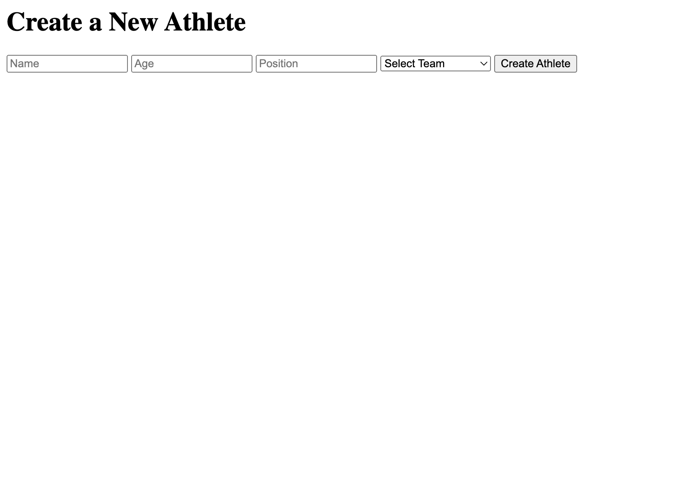

# Project-2Team-Management
"Team Management" is a platform that allows for sports coaches and mangers to keep track of their players and rosters. Is is the perfect application for maintaing all your team information current and clean! "Team Management" is easy to use and is the best applicaction for all sports and teams. 

## TRELLO BOARD 

The following Trello board was very helpful in planning the different functionalities that were eventually going to be a part of the application. They would first begin in either of the sectioons and later, once completed, move to the completed section. 

## WireFrame 

## Technolgies Used 

- Javascript
- Node.js
- Express 
- HTML
- CSS 
- Mongoose 
- MongoDB

